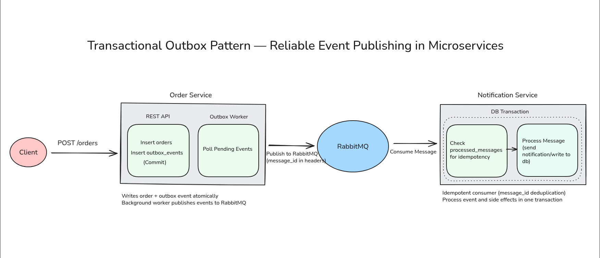
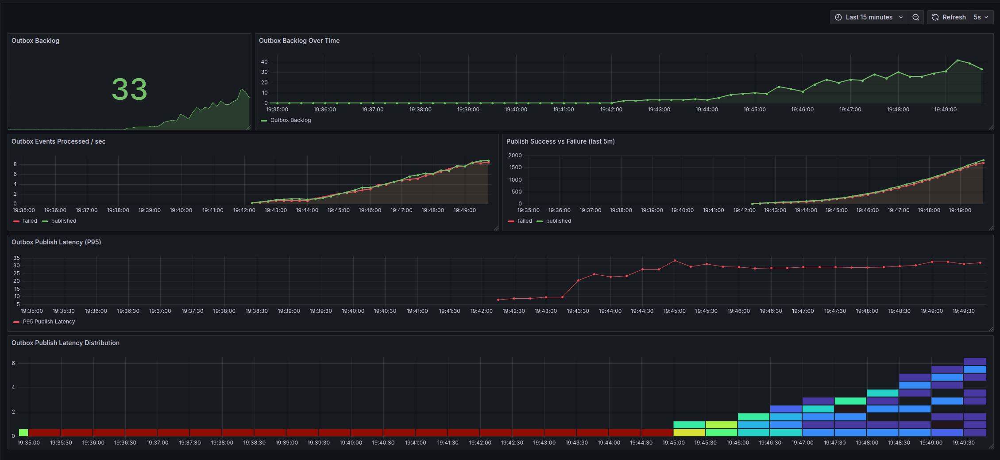
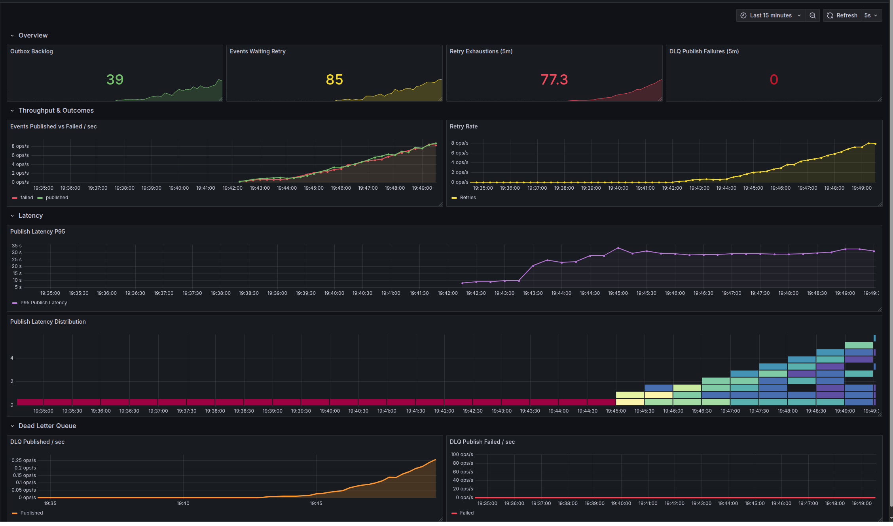
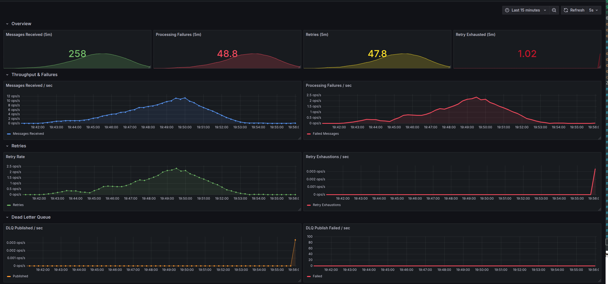
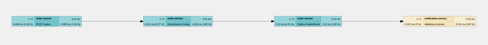

# Transactional Outbox RabbitMQ

This repository accompanies a **two-part series** on the **Transactional Outbox pattern**, demonstrating how to reliably publish domain events from a database-backed service using **Go**, **PostgreSQL**, **RabbitMQ**, and **Docker Compose**.

The focus is on **correctness, failure handling, and observability**, not frameworks or abstractions.

**Read the articles:**

- Article 1: _Transactional Outbox with RabbitMQ: Building Reliable Event Publishing in Microservices_
- Article 2: _Transactional Outbox with RabbitMQ: Handling Retries, Dead-Letter Queues, and Observability_ (coming soon)

## What This Repository Demonstrates

- Transactional outbox pattern with PostgreSQL
- Reliable event publishing without dual writes
- Worker-based outbox polling with retry and DLQ handling
- Consumer-side retries and dead-letter exchange pattern
- High-signal Prometheus metrics and Grafana dashboards
- End-to-end trace propagation with retry, publish, and consumer outcome attributes
- Correlated trace-logs using `logger.WithContext()`

## Architecture Overview

The system consists of two services and a shared broker:

- **Order Service**
  - Handles HTTP requests
  - Writes domain data and outbox events atomically
  - Publishes events asynchronously via an outbox worker
  - Implements **producer-side retries** and **DLQ publishing** on permanent failure

- **Notification Service**
  - Consumes events from RabbitMQ
  - Ensures idempotent processing using a local table
  - Implements **consumer retries** and **DLQ publishing** on permanent failure

**Each service owns its own database schema. There is no shared database.**



## Running Locally with Docker Compose

### Prerequisites

- [Docker](https://docs.docker.com/engine/install)

### Start all services

```bash
docker compose up --build
```

This starts:

- Order Service
- Notification Service
- Two isolated PostgreSQL databases
- RabbitMQ
- Prometheus
- Grafana
- Jaeger

All services wait for their dependencies via health checks before starting.

### Create an order

```bash
curl -X POST \
  -H "Content-Type: application/json" \
  -d '{"product_id":"sku123","quantity":1}' \
  http://localhost:4000/orders | jq
```

Example response:

```json
{
  "order": {
    "id": 1,
    "status": "pending",
    "created_at": "2026-01-10T15:57:41.309777771Z"
  }
}
```

### Expected logs

You should see the request flow across the entire system:

```bash
# HTTP request arrives
order-service         | {"level":"info","message":"Create Order Request Arrived"}

# Outbox worker picks up the event
order-service         | {"level":"info","count":1,"message":"Fetched outbox events"}
order-service         | {"level":"info","worker_id":2,"event_id":"a6f6d2df-f2f9-4a0f-98b7-73c99e96f75b","event_key":"order.created","message":"Worker processing event"}
order-service         | {"level":"info","routing_key":"order.created","outcome":"published","message":"RabbitMQ message published"}

# Notification service consumes the message
notification-service  | {"level":"info","message":"Broker Message Arrived"}
notification-service  | {"level":"info","payload":{"id":5,"product_id":"sku123","quantity":1},"outcome":"success","message":"Order email sent to customer"}
```

> You can replace `os.Stderr` with `zerolog.ConsoleWriter{Out: os.Stderr, TimeFormat: time.RFC3339}`in`main.go` to pretty print logs instead of JSON.

This confirms the full path:

**HTTP → DB → Outbox → Broker → Consumer → DLQ (if any)**

## Observability

### Metrics (Prometheus + Grafana)

The Order and Notification Services expose **high-signal metrics** covering:

- Outbox backlog
- Publish success / failure counts
- Retries and retry exhaustions
- DLQ publishes and publish failures
- End-to-end publish latency

**Grafana dashboards:**
Outbox Processing Dashboard (Article 1):


Outbox Reliability Dashboard (Article 2):


Consumer Processing Dashboard (Article 2):


Grafana is available at:

```
http://localhost:3000
```

(username/password: admin)

### Tracing (Jaeger)

Distributed tracing now includes:

- HTTP request span
- Outbox event creation
- Asynchronous publish span with `retry_count` and `outbox.outcome`
- Consumer processing span with `consumer.outcome`
- Correlated logs via `logger.WithContext()`

**Jaeger trace example (from the article):**



Jaeger UI:

```
http://localhost:16686
```

## Support & Contributions

If you find this repository useful, consider giving it a ⭐ — it helps others discover it.

Feedback, corrections, and discussions are very welcome.
Feel free to open an issue or submit a PR.
